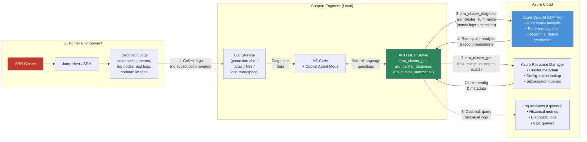

# ARO MCP Server

A Model Context Protocol (MCP) server for Azure Red Hat OpenShift (ARO) cluster management. This server enables AI assistants like GitHub Copilot to query, manage, and troubleshoot ARO clusters directly from VS Code.

## What is this?

This MCP server exposes ARO cluster operations as tools that AI agents can invoke. When connected to VS Code Copilot (Agent mode), you can ask natural language questions like:

- *"List my ARO clusters in subscription xyz"*
- *"Get details of aro-mcp-cluster in resource group aro-mcp-centralus"*
- *"What's the provisioning state of my ARO cluster?"*

Copilot will automatically call the `aro_cluster_get` tool to retrieve live data from your Azure subscription.

## Available Tools

| Tool | Description |
|---|---|
| `aro_cluster_get` | List all ARO clusters in a subscription, or get details of a specific cluster (profiles, networking, API server, worker nodes, provisioning state) |
| `aro_cluster_diagnose` | AI-powered diagnosis of ARO cluster issues using Azure OpenAI — sends cluster data and your question to GPT-4o for expert analysis |
| `aro_cluster_summarize` | AI-powered cluster summary — generates a health assessment, configuration overview, and recommendations using Azure OpenAI |

## Prerequisites

- [.NET 10 SDK](https://dotnet.microsoft.com/download/dotnet/10.0) or later
- [Azure CLI](https://learn.microsoft.com/cli/azure/install-azure-cli) (`az login` authenticated)
- [VS Code](https://code.visualstudio.com/) with [GitHub Copilot](https://marketplace.visualstudio.com/items?itemName=GitHub.copilot-chat) extension
- [Azure OpenAI](https://learn.microsoft.com/azure/ai-services/openai/) resource with a GPT-4o deployment (for diagnose/summarize tools)
- An Azure subscription with the `Microsoft.RedHatOpenShift` resource provider registered
- [kubectl](https://kubernetes.io/docs/tasks/tools/) or [oc CLI](https://mirror.openshift.com/pub/openshift-v4/clients/ocp/latest/) for cluster operations
- The pre-built `azmcp.exe` binary (see [Setup](#setup) below)

## Setup

### 1. Clone the repo

```bash
git clone https://github.com/sschinna/aro-mcp-server.git
cd aro-mcp-server
```

### 2. Install the Azure MCP Server binary

Download or build the `azmcp` binary and place it in `~/.aro-mcp/`:

```powershell
# Option A: Install from the official Azure MCP NuGet tool
dotnet tool install --global Azure.Mcp

# Option B: Use a pre-built binary
# Copy azmcp.exe to ~/.aro-mcp/ (Windows) or ~/.aro-mcp/ (Linux/macOS)
mkdir -p ~/.aro-mcp
cp /path/to/azmcp.exe ~/.aro-mcp/
```

### 3. Authenticate with Azure

On Windows, the Azure CLI may fail with AADSTS or token cache errors on first use. Run this **once** to fix:

```bash
az account clear
az config set core.enable_broker_on_windows=false
az login
az account set --subscription <YOUR_SUBSCRIPTION_ID>
```

> **Note:** The `az account clear` and `az config set` steps are only needed once. After that, `az login` works reliably.

### 4. Configure VS Code MCP Server

The repo includes `.vscode/mcp.json` which auto-registers the server when you open the workspace. No manual setup needed.

To add it to **another workspace** or **globally**, add this to your VS Code `settings.json`:

```json
{
  "mcp": {
    "servers": {
      "aro-mcp-server": {
        "type": "stdio",
        "command": "dotnet",
        "args": [
          "run", "--project",
          "/path/to/aro-mcp-server/tools/Azure.Mcp.Tools.Aro/src/Azure.Mcp.Tools.Aro.csproj",
          "--", "server", "start", "--transport", "stdio"
        ]
      }
    }
  }
}
```

### 5. Authenticate to your ARO cluster

Run the login script — it will ask how you want to connect:

```powershell
.\scripts\aro-login.ps1
```

```
ARO Cluster Login
  How would you like to connect?

  [S] Subscription lookup       — provide subscription ID, resource group, and cluster name
  [A] API Server direct login   — provide the ARO API server URL, username, and password

Choose login mode [S/A] (default: S):
```

#### Option A: Direct API Server Login (no Azure subscription needed)

If you already have the ARO API server URL and credentials (e.g., `kubeadmin` username/password), choose `[A]` or use the `-Direct` flag:

```powershell
# Interactive — prompts for API server URL, username, and password (password is hidden)
.\scripts\aro-login.ps1 -Direct
```

```powershell
# With parameters (password is always prompted securely, never passed as argument)
.\scripts\aro-login.ps1 -Direct `
  -ApiServer "https://api.mycluster.eastus.aroapp.io:6443" `
  -Username "kubeadmin"
```

```powershell
# With environment variables (password still prompted securely)
$env:ARO_API_SERVER = "https://api.mycluster.eastus.aroapp.io:6443"
$env:ARO_USERNAME = "kubeadmin"
.\scripts\aro-login.ps1 -Direct
```

> **Security:** The password is always prompted using `Read-Host -AsSecureString` and is never displayed, logged, or stored in shell history. It is cleared from memory immediately after login.

**Requirements:** Only the `oc` CLI is needed. No Azure CLI, no Azure subscription.

#### Option B: Subscription Lookup (automatic credential retrieval)

Choose `[S]` at the prompt, or provide parameters directly. This mode uses Azure CLI to automatically retrieve kubeadmin credentials and exchange them for an OAuth token — no need to know the password.

**Interactive mode (prompts for all values):**
```powershell
.\scripts\aro-login.ps1
```

**With parameters:**
```powershell
.\scripts\aro-login.ps1 `
  -SubscriptionId "<YOUR_SUBSCRIPTION_ID>" `
  -ResourceGroup "<YOUR_RESOURCE_GROUP>" `
  -ClusterName "<YOUR_CLUSTER_NAME>"
```

**With environment variables:**
```powershell
$env:AZURE_SUBSCRIPTION_ID = "<YOUR_SUBSCRIPTION_ID>"
$env:ARO_RESOURCE_GROUP = "<YOUR_RESOURCE_GROUP>"
$env:ARO_CLUSTER_NAME = "<YOUR_CLUSTER_NAME>"
.\scripts\aro-login.ps1
```

What the Azure mode script does:
1. Verifies Azure CLI login (auto-triggers `az login` if expired)
2. Retrieves cluster endpoint from Azure
3. Fetches kubeadmin credentials (never displayed)
4. Exchanges credentials for an OAuth token (never displayed)
5. Configures `~/.kube/config` with the token
6. Clears all sensitive data from memory

**Requirements:** Azure CLI (`az`), `kubectl`, an Azure subscription with access to the ARO cluster.

### Azure OpenAI Configuration (for AI Tools)

The `aro_cluster_diagnose` and `aro_cluster_summarize` tools require Azure OpenAI. Set these environment variables:

```powershell
$env:AZURE_OPENAI_ENDPOINT = "https://your-resource.openai.azure.com/"
$env:AZURE_OPENAI_DEPLOYMENT = "gpt-4o"  # Your model deployment name
```

Authentication uses `DefaultAzureCredential` (Azure CLI, Managed Identity, etc.). Ensure your identity has the **Cognitive Services OpenAI User** role on the Azure OpenAI resource.

#### After login (either mode)

```bash
kubectl get nodes
kubectl get clusteroperators
kubectl top nodes
oc get pods -A
oc get clusterversion
```

### 6. Use with Copilot

1. Open VS Code and switch Copilot Chat to **Agent mode**
2. Click the **Tools icon** (wrench) to verify `aro_cluster_get` is listed
3. Ask a question about your ARO clusters

## Customer Issue Diagnosis (Without Creating Clusters)

One of the most powerful use cases for the ARO MCP Server is **diagnosing customer cluster issues without creating any ARO clusters in your own subscription**. Instead of provisioning infrastructure to reproduce a problem, you feed diagnostic data into the MCP server's AI tools and get expert-level root cause analysis instantly.

### Why This Matters

| Traditional Approach | With ARO MCP Server |
|---|---|
| Reproduce issue in your own subscription | No cluster needed — analyze logs directly |
| Create ARO cluster (~35-45 min + cost) | Instant analysis via Azure OpenAI |
| Manually correlate logs, events, node status | AI correlates all data automatically |
| Requires deep OpenShift/K8s expertise | LLM provides expert-level insights |
| Analysis tied to one engineer's knowledge | Consistent, repeatable analysis across the team |

### Step-by-Step: Diagnosing a Customer Issue

#### Step 1 — Collect Diagnostic Data from the Customer

Ask the customer (or collect via jump host) to run these commands on their ARO cluster. You do **not** need access to the customer's Azure subscription:

**Cluster overview:**
```bash
oc get nodes -o wide
oc adm top nodes
oc get clusterversion
oc get clusteroperators
```

**Node health (for each problematic node):**
```bash
oc describe node <node-name>
oc get node <node-name> -o jsonpath='{.spec.taints}'
```

**Pod scheduling issues:**
```bash
oc get pods -n <namespace> --field-selector status.phase!=Running
oc describe pod <stuck-pod-name> -n <namespace>
oc get events -n <namespace> --sort-by='.lastTimestamp' | tail -30
```

**Storage issues:**
```bash
oc get pvc -n <namespace>
oc describe pvc <pvc-name> -n <namespace>
oc get pv <pv-name> -o yaml
```

**Node disk pressure (SSH/debug pod):**
```bash
oc debug node/<node-name>
chroot /host
df -h /
du -sh /var/lib/containers/storage
podman images --format "{{.Repository}}:{{.Tag}} {{.Size}}"
crictl ps -a --state exited | wc -l
```

**Pipeline-specific (Tekton):**
```bash
oc get pipelinerun -n <namespace>
oc get configmap feature-flags -n openshift-pipelines -o yaml
oc describe pipelinerun <run-name> -n <namespace>
```

#### Step 2 — Open VS Code with ARO MCP Server

1. Open VS Code with the `aro-mcp-server` workspace (or any workspace with the MCP server configured)
2. Switch Copilot Chat to **Agent mode** (click the mode dropdown)
3. Verify the MCP tools are loaded — click the **Tools icon** (wrench) and confirm `aro_cluster_diagnose` is listed

#### Step 3 — Feed Diagnostic Data to the AI

Paste the collected diagnostic output into the Copilot chat along with the customer's problem description:

```
User: Customer's Tekton pipeline pods are stuck in Pending state on their ARO cluster.
      They have 4 worker nodes and 5 dedicated infra nodes.
      
      Here's the output from their cluster:
      
      [paste oc get nodes -o wide output]
      [paste oc adm top nodes output]
      [paste oc describe node output for problematic nodes]
      [paste oc get events output]
      [paste oc describe pvc output]
      [paste podman images output from the node]
```

#### Step 4 — Receive AI-Powered Root Cause Analysis

The MCP server sends the data to Azure OpenAI (GPT-4o) via the `aro_cluster_diagnose` tool and returns structured analysis:

```
Copilot → aro_cluster_diagnose:

  ROOT CAUSE:
  ✅ 3 of 4 worker nodes at 95-99% CPU requests — no scheduling headroom
  ✅ All pipeline builds forced onto the only node with available CPU (fqzxn)
  ✅ 12 stale pipeline images (4 GB each) accumulated → 141 GB → DiskPressure
  ✅ DiskPressure taint makes the node unschedulable → 0 nodes available

  IMMEDIATE FIX:
  • Clean stale pipeline images: podman rmi old int-server images
  • Delete completed PipelineRuns: oc delete pipelinerun <old-runs>
  • Verify disk pressure taint clears automatically

  LONG-TERM RECOMMENDATIONS:
  • Add 2+ worker nodes via MachineSet (cluster is under-provisioned)
  • Configure Tekton pruner to auto-delete old PipelineRuns
  • Tune ImageGC thresholds (75% instead of 85%)
  • Switch pipelines to volumeClaimTemplate for ephemeral PVCs
```

#### Step 5 — Generate Customer Recommendation

Ask Copilot to format the analysis into a customer-facing recommendation:

```
User: Draft a customer recommendation document with the root cause,
      immediate actions, and long-term fixes with commands.
```

The AI generates a professional write-up with:
- Root cause analysis table
- Step-by-step remediation commands
- Priority-ordered recommendations (P0/P1/P2/P3)
- Capacity planning guidance

### What You Can Diagnose

| Category | Examples |
|---|---|
| **Scheduling failures** | Pod stuck Pending, taint/toleration mismatches, node affinity conflicts, insufficient CPU/memory requests |
| **Disk pressure** | Image accumulation from CI/CD pipelines, ephemeral storage exhaustion, container log bloat, ImageGC failures |
| **Networking issues** | DNS resolution failures, ingress/route misconfigurations, egress firewall blocks, OVN/SDN issues |
| **Cluster operators** | Degraded/unavailable operators, certificate expiration, etcd health, authentication failures |
| **Upgrade failures** | Version incompatibilities, stuck MachineConfigPools, failed machine rollouts, deprecated API usage |
| **Pipeline/CI-CD** | Tekton scheduling with `coschedule`, PVC zone pinning, build image storage, pipeline run cleanup |
| **Storage** | PVC zone affinity conflicts, StorageClass misconfiguration, disk provisioning failures, RWO access mode constraints |
| **Capacity planning** | Node count recommendations, VM SKU sizing, workload distribution analysis, headroom calculations |

### Real-World Example: PepsiCo Tekton Pipeline Failure

This is a real case diagnosed entirely through the ARO MCP Server without creating any clusters:

| Phase | What Happened | How MCP Server Helped |
|---|---|---|
| **Initial report** | Pipeline pods stuck Pending | Analyzed `oc describe pod` events — identified PVC + node affinity conflict |
| **Node investigation** | 1 node had DiskPressure | Analyzed `oc adm top nodes` + taints — found 141 GB in container storage |
| **Root cause** | 12 stale 4 GB images from old builds | Analyzed `podman images` output — identified pipeline image accumulation |
| **Deeper analysis** | Why only 1 node? | Analyzed `oc describe node` allocations — found 3/4 workers at 99% CPU |
| **Resolution** | Clean images + add nodes | Generated step-by-step cleanup commands + capacity planning recommendation |

**Total time:** ~30 minutes from first diagnostic paste to complete customer recommendation document.
**Clusters created:** Zero.
**Azure cost:** Only the Azure OpenAI API calls (~$0.05).

### Architecture — Data Flow with LLM and Log Storage



### How Each Component Works

| Component | Role | Required? |
|---|---|---|
| **VS Code + Copilot** | User interface — paste logs, ask questions, receive analysis | Yes |
| **ARO MCP Server** | Routes requests to the correct tool (get, diagnose, summarize) | Yes |
| **Azure OpenAI (GPT-4o)** | LLM that analyzes diagnostic data and generates root cause + recommendations | Yes (for diagnose/summarize) |
| **Azure Resource Manager** | Queries live cluster metadata from Azure (if you have subscription access) | Optional — not needed for log-based diagnosis |
| **Log Analytics** | Stores and queries historical diagnostic logs via KQL | Optional — for monitoring trends |
| **Customer's Cluster** | Source of diagnostic data — you never need direct access | Only the customer accesses it |

**Key insight:** The LLM (Azure OpenAI) receives the cluster diagnostic data and returns expert analysis. No customer cluster access or Azure subscription is needed from the engineer — only the diagnostic output (logs, descriptions, events) collected by the customer or via a jump host.

## Teammate Onboarding (Quick Start)

If a teammate clones this repo, here's the minimal checklist to get everything working:

### Step-by-step

1. **Install .NET 10 SDK**
   ```bash
   # Verify: dotnet --version should show 10.x
   ```

2. **Install Azure CLI and authenticate**
   ```bash
   az account clear                              # one-time fix for Windows token cache
   az config set core.enable_broker_on_windows=false  # one-time fix for Windows
   az login
   az account set --subscription <SUBSCRIPTION_ID>
   ```

3. **Build the MCP server plugin**
   ```bash
   cd aro-mcp-server
   dotnet build tools/Azure.Mcp.Tools.Aro/src/Azure.Mcp.Tools.Aro.csproj
   ```

4. **Install the Azure MCP runtime** — Place `azmcp.exe` in `~/.aro-mcp/`:
   ```powershell
   # Option A: Install via .NET global tool
   dotnet tool install --global Azure.Mcp

   # Option B: Copy a pre-built binary
   New-Item -ItemType Directory -Force "$env:USERPROFILE\.aro-mcp"
   Copy-Item /path/to/azmcp.exe "$env:USERPROFILE\.aro-mcp\"
   ```

5. **Open the workspace in VS Code** — `.vscode/mcp.json` auto-registers the server. No manual config needed.

6. **Login to your ARO cluster**
   ```powershell
   .\scripts\aro-login.ps1
   ```

7. **(Optional) Configure Azure OpenAI for AI tools** — Only needed for `aro_cluster_diagnose` and `aro_cluster_summarize`:
   ```powershell
   $env:AZURE_OPENAI_ENDPOINT = "https://<your-resource>.openai.azure.com/"
   $env:AZURE_OPENAI_DEPLOYMENT = "gpt-4o"
   ```
   Your identity also needs the **Cognitive Services OpenAI User** role on the Azure OpenAI resource.

### What works out of the box vs. what doesn't

| Component | Portable? | Notes |
|---|---|---|
| Source code & build | ✅ Yes | Standard .NET project, no hardcoded paths |
| `.vscode/mcp.json` | ✅ Yes | Uses `azmcp` from PATH or `~/.aro-mcp/` (via `$(USERPROFILE)`) |
| Azure authentication | ✅ Yes | `DefaultAzureCredential` — works with any user's `az login` |
| `azmcp.exe` runtime | ⚠️ Manual | Must be installed per-user (see step 4) |
| ARO cluster access | ⚠️ Manual | Each user needs `az login` + RBAC on the subscription |
| Azure OpenAI (AI tools) | ⚠️ Optional | Env vars + role assignment needed (see step 7) |
| `obj/` build artifacts | ✅ Gitignored | User-specific NuGet paths in `obj/` are not committed |

## Usage Examples

### With Copilot (Agent Mode)

**List all clusters in a subscription:**
```
User: List my ARO clusters
```

**Get specific cluster details:**
```
User: Get details of my-aro-cluster in resource group my-aro-rg
```

**Check cluster health:**
```
User: What is the provisioning state and worker count of my ARO cluster?
```

**Node and operator diagnostics (via kubectl/oc):**
```
User: Check the ARO cluster node health and CPU utilization
User: Share the cluster operators status
User: Check DNS health on my ARO cluster
```

### With kubectl / oc CLI

After running `.\scripts\aro-login.ps1` (or `.\scripts\aro-login.ps1 -Direct`):

```bash
# Node status
kubectl get nodes -o wide

# CPU and memory utilization
kubectl top nodes

# Cluster operators
oc get clusteroperators

# DNS health
oc get dns.operator/default -o yaml
oc get pods -n openshift-dns

# Pod status across all namespaces
oc get pods -A --field-selector status.phase!=Running

# Cluster version
oc get clusterversion
```

### Direct oc login (without the script)

> **Security:** Never pass passwords on the command line (e.g., `oc login -p <password>`). Passwords in command-line arguments are visible in process lists, shell history, and terminal logs.

Use `oc login` interactively instead — it will prompt for the password securely:

```bash
oc login https://api.mycluster.eastus.aroapp.io:6443 -u kubeadmin --insecure-skip-tls-verify
# Password: (enter securely at prompt — not displayed)
```

For automated/non-interactive flows, prefer the login script which retrieves credentials via Azure CLI and exchanges them for an OAuth token without ever exposing them:

```powershell
.\scripts\aro-login.ps1
```

The tool returns cluster metadata including:
- Cluster profile (domain, version, FIPS status)
- API server profile (URL, IP, visibility)
- Console URL
- Network profile (pod CIDR, service CIDR, outbound type)
- Master profile (VM size, subnet, encryption)
- Worker profiles (count, VM size, disk size, zones)
- Ingress profiles
- Provisioning state
- Tags

## Troubleshooting

### `az login` fails with AADSTS errors or token cache issues

If you see errors like `Can't find token from MSAL cache`, `AADSTS50076`, or `AADSTS5000224`:

```bash
az account clear
az config set core.enable_broker_on_windows=false
az login
```

This disables the Windows WAM broker and switches to browser-based authentication.

### MCP server fails to start in VS Code

1. Open the Command Palette (`Ctrl+Shift+P`) → **MCP: List Servers** → find `aro-mcp-server` → **Restart**
2. Ensure you are authenticated: `az account show`
3. Verify the `Microsoft.RedHatOpenShift` resource provider is registered:
   ```bash
   az provider show --namespace Microsoft.RedHatOpenShift --query "registrationState" -o tsv
   ```
4. Check the Output panel in VS Code (select "MCP" from the dropdown) for error details

### `kubectl` / `oc` commands fail with authentication errors

Your cluster token may have expired (tokens last 24 hours). Re-run the login script:
```powershell
.\scripts\aro-login.ps1
```

### Installing the `oc` CLI

Download from the [OpenShift mirror](https://mirror.openshift.com/pub/openshift-v4/clients/ocp/latest/):

```powershell
# Windows (PowerShell)
curl.exe -sLo "$env:TEMP\oc.zip" "https://mirror.openshift.com/pub/openshift-v4/clients/ocp/latest/openshift-client-windows.zip"
Expand-Archive "$env:TEMP\oc.zip" "$env:TEMP\oc-install" -Force
Copy-Item "$env:TEMP\oc-install\oc.exe" "$env:USERPROFILE\.aro-mcp\oc.exe"
# Add ~/.aro-mcp to your PATH
```

## Tool Parameters

### `aro_cluster_get`

| Parameter | Required | Description |
|---|---|---|
| `--subscription` | Yes | Azure subscription ID |
| `--resource-group` | No | Resource group name (required if `--cluster` is specified) |
| `--cluster` | No | ARO cluster name. If omitted, lists all clusters in the subscription |

## ARO Cluster Deployment (Bicep)

The `aro-deploy/` directory contains a Bicep template for creating an ARO cluster with **managed identity** (no service principal needed). This avoids credential lifetime policy issues common in enterprise tenants.

### Prerequisites for Deployment

1. **Register the ARO resource provider** (one-time per subscription):
   ```bash
   az provider register --namespace Microsoft.RedHatOpenShift --wait
   az provider show --namespace Microsoft.RedHatOpenShift --query "registrationState" -o tsv
   # Should output: Registered
   ```

2. **Check available ARO versions** in your target region:
   ```bash
   az aro get-versions --location centralus -o table
   ```

3. **Verify VM SKU availability** (some subscriptions restrict certain SKUs):
   ```bash
   az vm list-skus --location centralus --resource-type virtualMachines \
     --query "[?name=='Standard_D8s_v3'].restrictions" -o table
   ```
   If restricted, try a different region or VM size.

4. **Get the ARO Resource Provider service principal Object ID**:
   ```bash
   az ad sp list --display-name "Azure Red Hat OpenShift RP" --query '[0].id' -o tsv
   ```

### Deploy an ARO Cluster

#### Cluster Creation Demo Video

https://github.com/sschinna/aro-mcp-server/releases/download/demo-videos/aro_cluster_creation_compressed.mp4

```bash
# Set variables
LOCATION=centralus
RESOURCEGROUP=aro-rg
CLUSTER=my-aro-cluster
VERSION=4.18.34    # Use a version from az aro get-versions
ARO_RP_SP_OBJECT_ID=$(az ad sp list --display-name "Azure Red Hat OpenShift RP" --query '[0].id' -o tsv)

# Create resource group
az group create --name $RESOURCEGROUP --location $LOCATION

# Deploy ARO cluster (~35-45 minutes)
az deployment group create \
  --name aroDeployment \
  --resource-group $RESOURCEGROUP \
  --template-file aro-deploy/azuredeploy.bicep \
  --parameters location=$LOCATION \
  --parameters version=$VERSION \
  --parameters clusterName=$CLUSTER \
  --parameters rpObjectId=$ARO_RP_SP_OBJECT_ID
```

> **Note:** Deployment takes approximately 35-45 minutes. If a role assignment fails due to identity propagation delays, simply re-run the deployment — it is idempotent.

### What the Bicep Template Creates

| Resource | Count | Description |
|---|---|---|
| Virtual Network | 1 | With master and worker subnets |
| User-Assigned Managed Identities | 9 | Cluster identity + 8 operator identities |
| Role Assignments | 20 | Permissions for all operator identities |
| ARO Cluster | 1 | With `platformWorkloadIdentityProfile` and managed identity |

Default configuration:
- **Master nodes:** 3x `Standard_D8s_v3`
- **Worker nodes:** 3x `Standard_D4s_v3` (128 GB disk)
- **Network:** Pod CIDR `10.128.0.0/14`, Service CIDR `172.30.0.0/16`
- **Visibility:** Public API server and ingress

### Customizable Parameters

| Parameter | Default | Description |
|---|---|---|
| `location` | Resource group location | Azure region |
| `version` | *(required)* | OpenShift version (e.g., `4.18.34`) |
| `clusterName` | *(required)* | Unique cluster name |
| `rpObjectId` | *(required)* | ARO RP service principal Object ID |
| `masterVmSize` | `Standard_D8s_v3` | Master node VM size |
| `workerVmSize` | `Standard_D4s_v3` | Worker node VM size |
| `workerVmDiskSize` | `128` | Worker disk size in GB |
| `apiServerVisibility` | `Public` | `Public` or `Private` |
| `ingressVisibility` | `Public` | `Public` or `Private` |
| `fips` | `Disabled` | FIPS-validated crypto modules |
| `pullSecret` | *(empty)* | Red Hat pull secret from cloud.redhat.com |

### Post-Deployment

```bash
# Verify cluster is running
az aro show --name $CLUSTER --resource-group $RESOURCEGROUP \
  --query "{state:provisioningState, console:consoleProfile.url, api:apiserverProfile.url}" -o table

# Access the OpenShift console
az aro show --name $CLUSTER --resource-group $RESOURCEGROUP --query consoleProfile.url -o tsv

# Login securely using the login script (credentials never exposed)
# The script retrieves credentials via Azure CLI and exchanges them for an OAuth token
pwsh ./scripts/aro-login.ps1 -SubscriptionId "$SUBSCRIPTION_ID" -ResourceGroup "$RESOURCEGROUP" -ClusterName "$CLUSTER"

# Or login interactively (oc prompts for password securely)
API_URL=$(az aro show --name $CLUSTER --resource-group $RESOURCEGROUP --query apiserverProfile.url -o tsv)
oc login $API_URL -u kubeadmin --insecure-skip-tls-verify
# Password: (enter at secure prompt)

# IMPORTANT: Never use 'az aro list-credentials' output directly on the command line.
# Credentials in command-line arguments are visible in process lists and shell history.
```

### Cleanup

```bash
# Delete the ARO cluster and all resources
az aro delete --name $CLUSTER --resource-group $RESOURCEGROUP --yes
az group delete --name $RESOURCEGROUP --yes --no-wait
```

## Project Structure

```
aro-mcp-server/
├── .vscode/
│   └── mcp.json                          # VS Code MCP server auto-config
├── scripts/
│   └── aro-login.ps1                     # Secure ARO cluster authentication
├── aro-deploy/
│   └── azuredeploy.bicep                 # ARO cluster Bicep template (managed identity)
├── Directory.Build.props                 # Shared build settings (net10.0)
├── Directory.Packages.props              # Centralized NuGet package versions
├── aro-mcp-server.sln                    # Solution file
└── tools/
    └── Azure.Mcp.Tools.Aro/
        ├── src/
        │   ├── AroSetup.cs               # Tool area registration (IAreaSetup)
        │   ├── Commands/
        │   │   ├── AroJsonContext.cs      # AOT-compatible JSON serialization
        │   │   ├── BaseAroCommand.cs      # Base command class
        │   │   └── Cluster/
        │   │       └── ClusterGetCommand.cs  # aro_cluster_get implementation
        │   ├── Models/
        │   │   └── Cluster.cs            # ARO cluster model
        │   ├── Options/
        │   │   ├── AroOptionDefinitions.cs
        │   │   ├── BaseAroOptions.cs
        │   │   └── Cluster/
        │   │       └── ClusterGetOptions.cs
        │   └── Services/
        │       ├── AroService.cs         # Azure ARM client for ARO
        │       └── IAroService.cs
        └── tests/
            └── Azure.Mcp.Tools.Aro.UnitTests/
                └── Cluster/
                    └── ClusterGetCommandTests.cs
```

## Sharing with Your Team

| Team size | Recommended approach |
|---|---|
| 2-5 | Clone this repo, each person runs locally |
| 5-20 | Publish a self-contained binary: `dotnet publish -c Release -r win-x64 --self-contained` |
| 20+ | Host as HTTP/SSE server for centralized access |

### Build from Source

The project references core MCP libraries via DLL from the `azmcp` install directory (`~/.aro-mcp/`). To build:

```bash
git clone https://github.com/sschinna/aro-mcp-server.git
cd aro-mcp-server
dotnet build
```

To build with a custom `azmcp` location:
```bash
dotnet build /p:AzmcpDir=/path/to/azmcp/directory
```

## License

MIT
